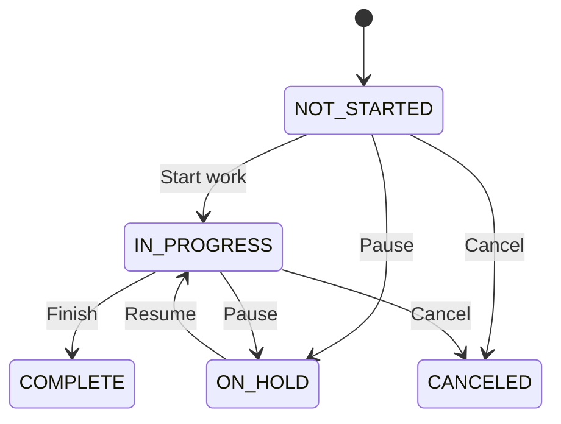

# ToDo Project
## O que deve ser realizado?
Sua tarefa é terminar de implementar o serviço de tasks

O que deve ser possível de realizar:

- Criar tasks (falta o mapping para isso)
- Atualizar tasks (falta o mapping e terminar de implementar o método updateTask no TaskService)

## Regras:
- Há uma hierarquia de status, as atualizações só podem ocorrer nesse fluxo descrito abaixo:

- O usuário só pode interagir com as próprias tasks (essa regra já está implementada, seria apenas manter ela mesmo)
